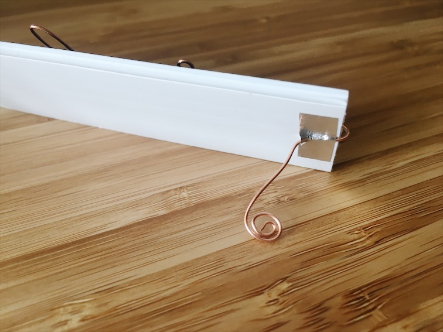

For our first assignment, we created a nameplate using existing skills.

- **Materials:** poster board, copper wire, tape. 
- **Tools:** scissors, wire cutters.

While creating a nameplate, I decided I wanted to make something compact with materials I already have access to. I often volunteer at the Pacific Science center on weekends, where I have access to an abundance of scrap craft materials. Since I've been helping out with some electronics projects there, I immediately thought of using wire to shape my name.

I ended up finding this beautiful copper wire that I bent into the shape of my name, and taped onto a piece of black poster board for contrast. Since the wire is fairly study, I realized that I could bend it to create movable legs. This way, I could bend it flat to store in my backpack during my commute, then bend it out to place on the table.

I realized afterwards that I should have made it larger. I kept it simple this week, but I figure there is plenty of time to add onto my nameplate with new skills that I gain. :)