

    
     <small><em>A CNC milled box!</em></small> 

<h1>Overview</h1>

This week, we used the Bantam CNC machine to precisely cut a box with FR1 (PCB material).

<h2>Tools and Materials</h2>
<ul>
    <li>FR1 PCB board</li>
    <li>Double-sided tape</li>
    <li>Bantam CNC Machine</li>
</ul>
<h2>Software</h2>
<ul>
    <li>Onshape</li>
    <li>KiCad</li>
    <li>BantamTools </li>
</ul>

<h1>Ideation</h1>

This week's assignment was more straightforward than most - we were tasked to mill and fit together a box made out of FR1 PCB material that is sturdy and precise. I envisioned slotting together the box like a puzzle toy and designed my box out of 6 identical pieces.

When I cut a box for my mechanism last week, I used teeth that slot together. The downside to this design  was that the pieces didn't really stay together. I "learned" from my mistake last week and decided to use slots  this week to make the box more sturdy.

<h1>Process</h1>

<h2>Designing with Onshape</h2>

I didn't feel like sketching out the geometry my box on paper this time, so I outsourced the calculations to Onshape, because computers are good at math! I started with a rough sketch and some basic parameters (FR1 thickness, slot width, etc) and extruded my sketch to make a side of the box.

    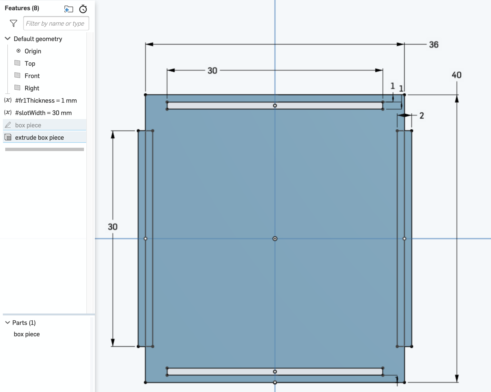
     <small><em>Early sketch with dimensions</em></small> 

    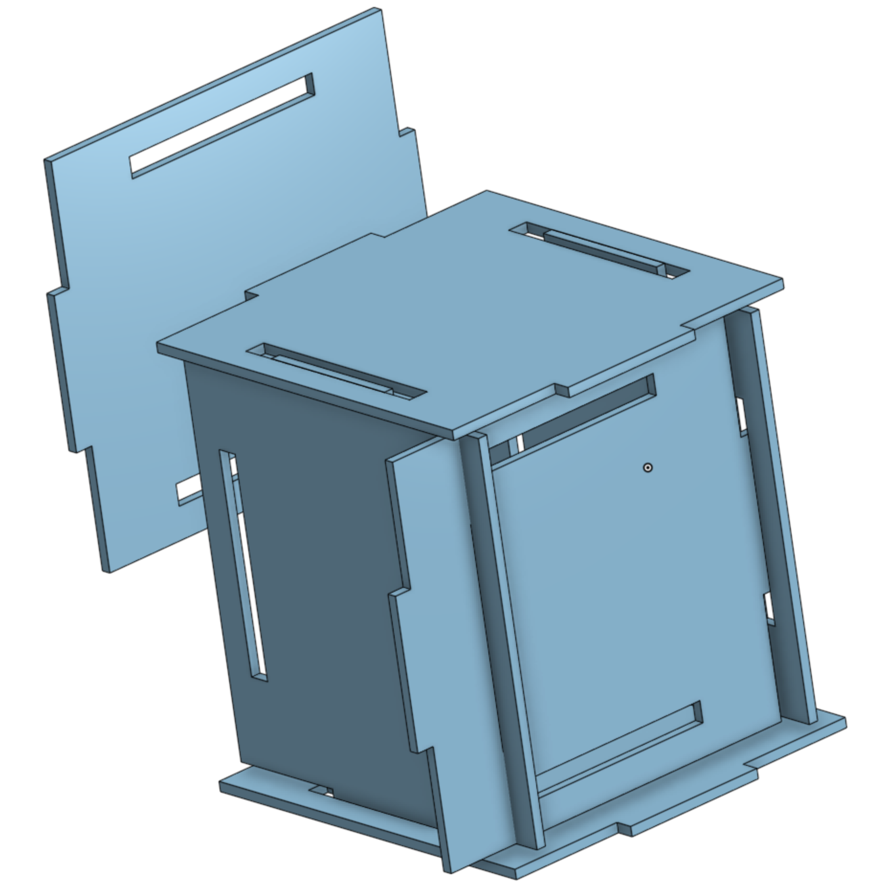
    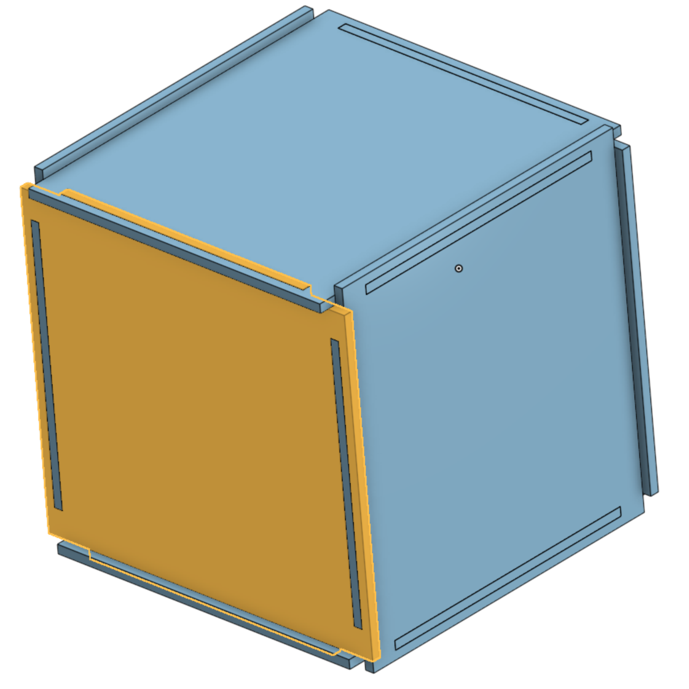
     <small><em>Starting a rough sketch in Onshape.</em></small> 

I then made an assembly with 6 of those pieces and used fixed mates to attach the pieces. I knew that it wouldn't be perfect from the start, but this helped me better visualize the calculations I needed to get everything to line up. I added fillets to all of the sharp corners to keep the CNC mill happy, and made a couple rounds of iterations on this design.

    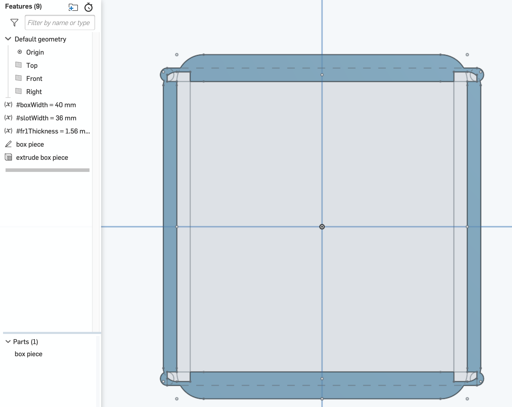
    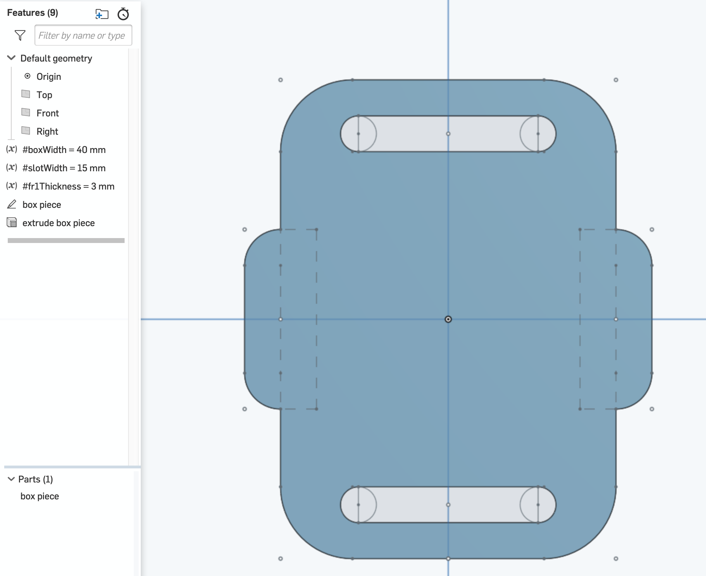
     <small><em>Using vars helped me iterate quickly.</em></small> 

    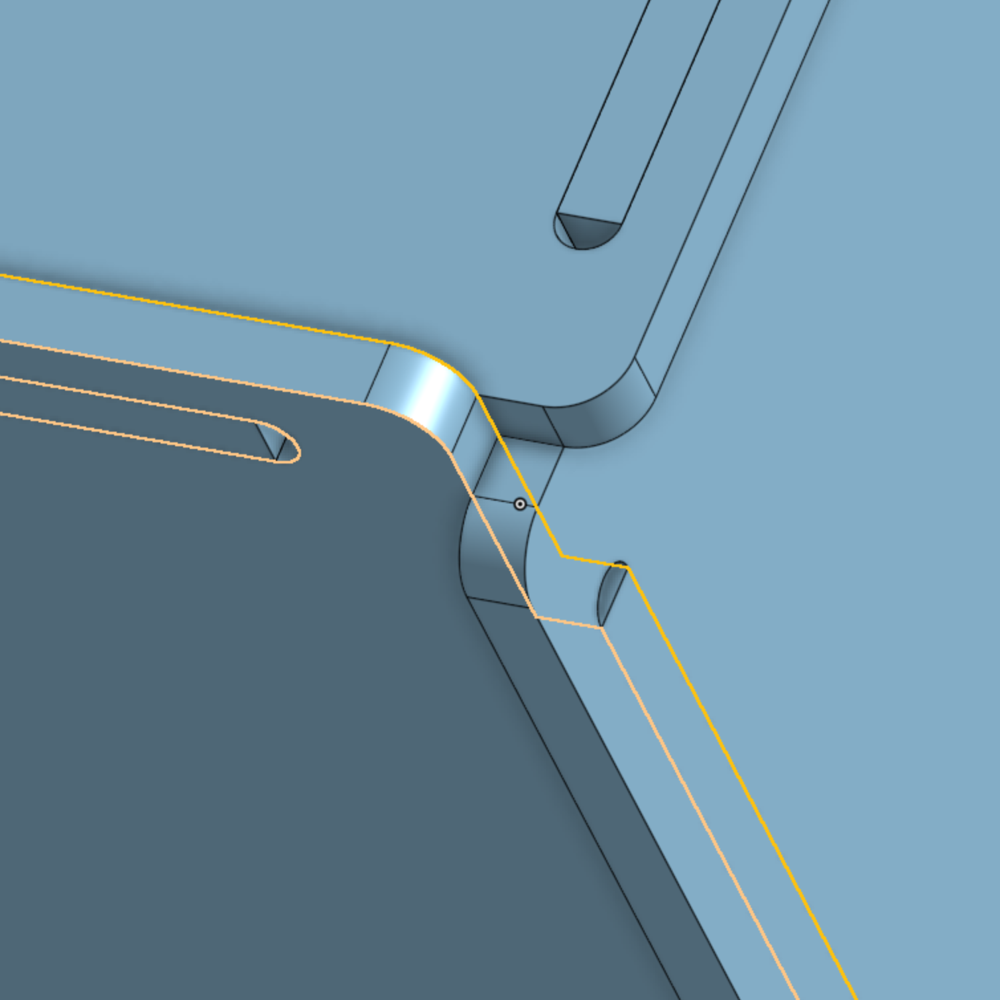
    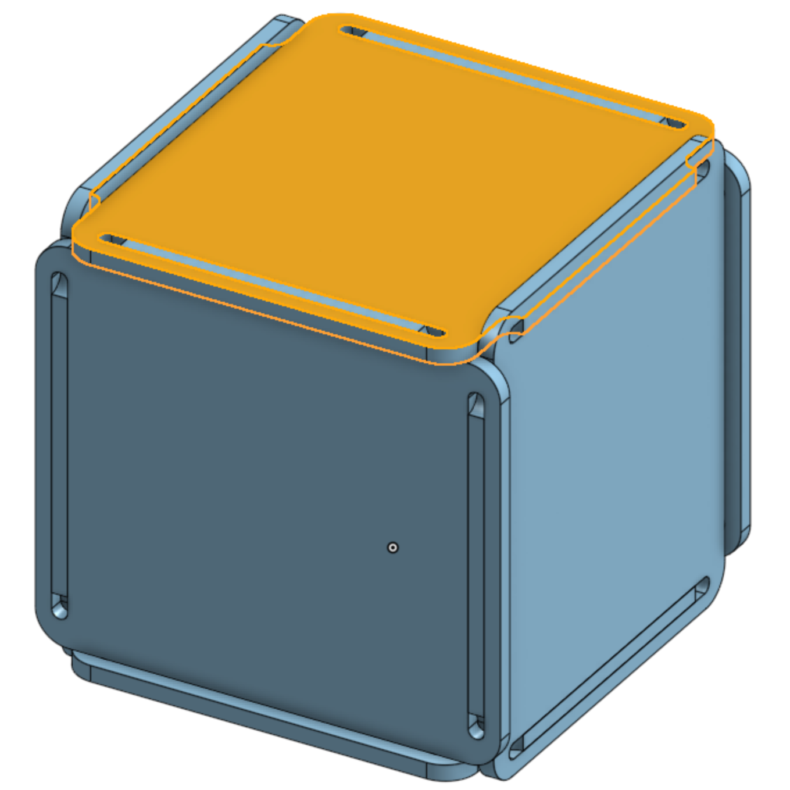
     <small><em>The final assembly with the thickness of the FR1 set.</em></small> 

<h2>Importing to KiCad and Bantam</h2>

As a precaution, I had already ensured that all of my files and measurements would be set to millimeters beforehand. When I was done designing the box in Onshape, I followed @JoshuaV's instructions on exporting a .dxf file, importing to KiCad, and then importing to Bantam tools, which was surprisingly painless.

<h2>CNC Milling!</h2>

After a couple very minor hiccups setting up the Bantam CNC mill, I was able to mill out my pieces without much trouble. Cutting tiny, precise parts was tremendously satisfying (if a little slow) and I enjoyed having my own tiny machine rather than rushing at the laser cutter.

    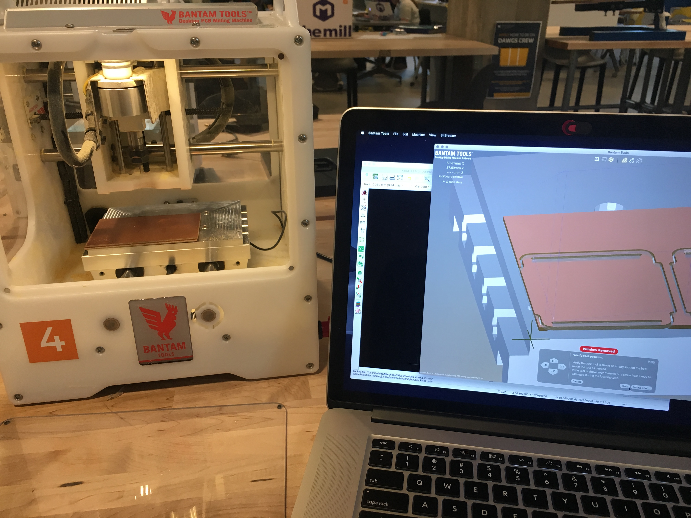
     <small><em>My lil CNC station.</em></small> 

    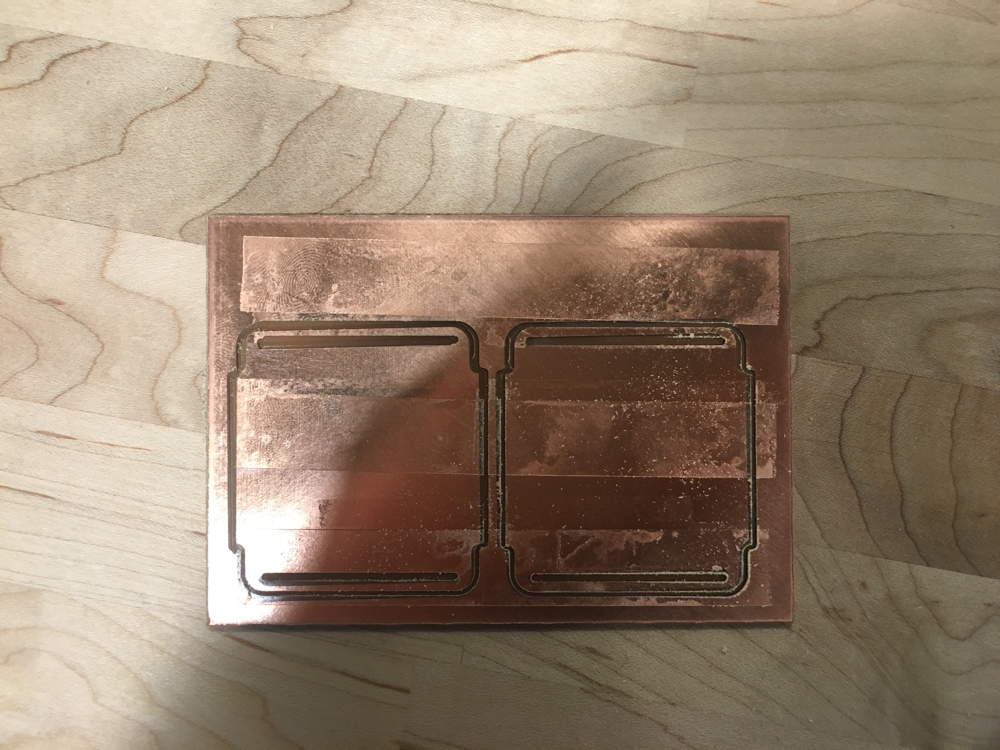
     <small><em>The sacrificial offering to the CNC machine.</em></small> 

<h1>Results</h1>

First off, I am delightfully amused at the idea of using gerber files to cut 2D shapes out. I think the process is quite emblematic of the file format gynastics of digital fabrication. I also have a soft spot for good PCB design so I like the idea of combining the technical and the visual design. Maybe someday I'll be able to mill out the time to work on some side projects...

    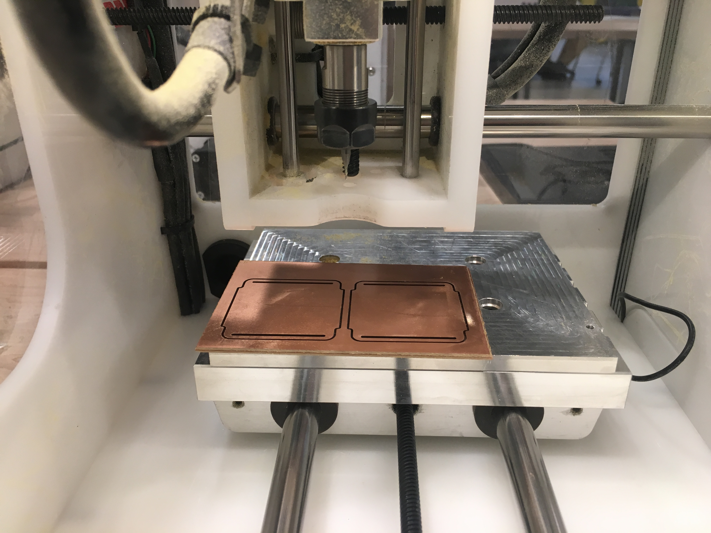
     <small><em>So satisfying. :')</em></small> 

My final box actually fit together a little <em>too</em> well! I ended up jamming the pieces together to scrape off a bit of material. If I were to redo this box, I would definitely make it with regular teeth connections rather than slots, because I had a really hard time fitting the 6th piece in (and broke a corner of it in the process. I think I got a little too used to the "give" of cardboard so I was caught a bit off guard!

    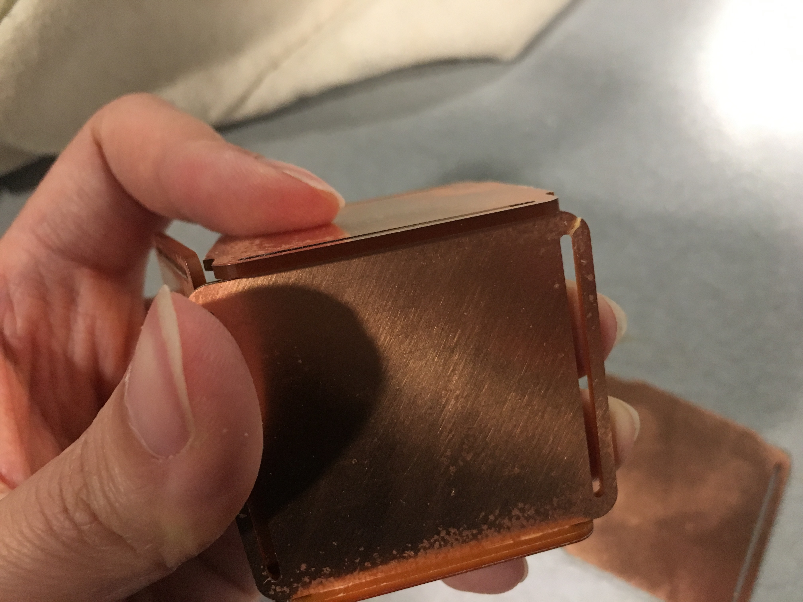
     <small><em>Accidentally snapped a bit.</em></small> 

I think I'll leave the 6th piece off and fill the rocks with gravel to make a pen holder for work. Yay, I finally made something useful!

    
     <small><em>Shake test!</em></small> 

    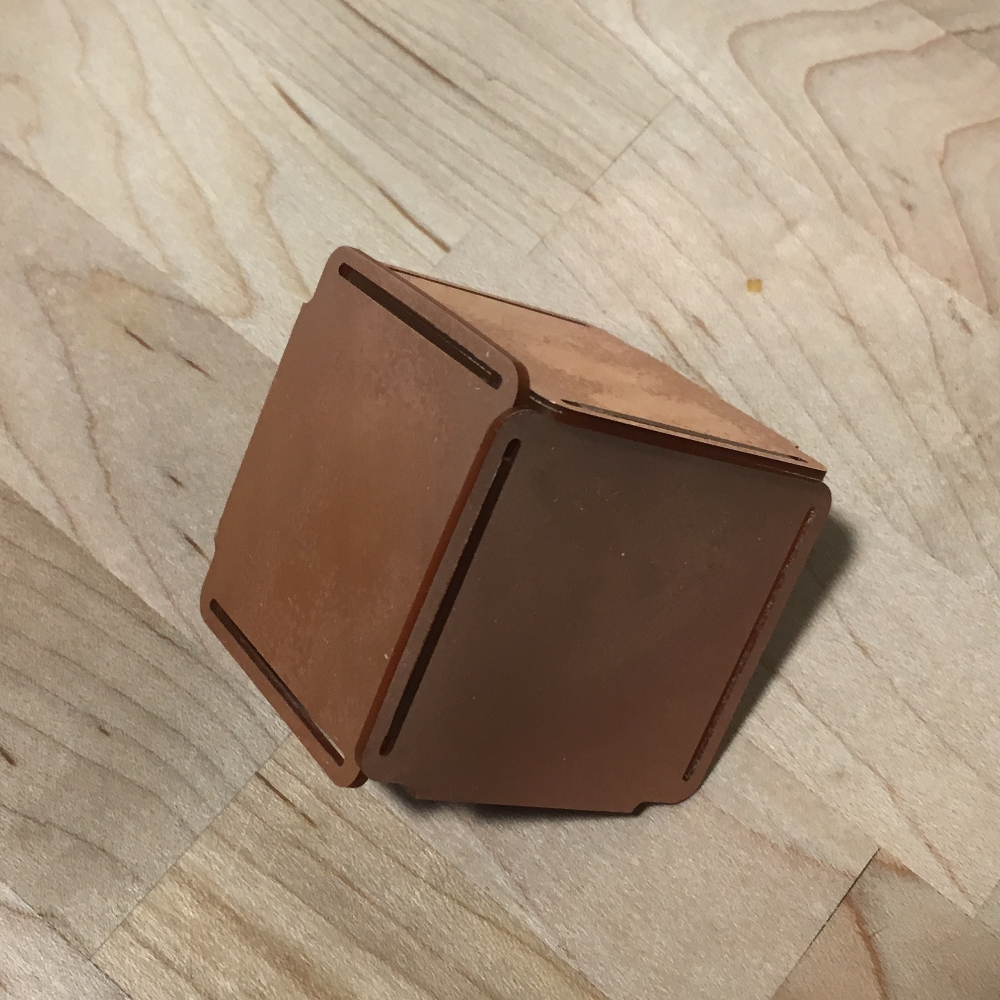
     <small><em>A partial assembly.</em></small> 

<h1>Source Files</h1>
<ul>
<li>
    <a href="https://cad.onshape.com/documents/b34b1ad9ca4c3b7201f08da2/w/82f26904cdda91ff9d5581ef/e/073af1659482d41f0fd1a1c6" target="_blank">A working link to the Onshape CNC Box :)</a>
</li>
<li>
    <a href="https://github.com/dotj/hcde598/tree/master/a5" target="_blank">Other related files</a>
</li>
</ul>

<h1>Acknowledgments</h1>

Thank you to Irina, Lukas, Leo,  Christa, Dhwani,  Corynne, and D'Marcus for the help

<h1>Bonus</h1>

    
     <small><em>I finally jumped on the giphy bandwagon.</em></small> 

