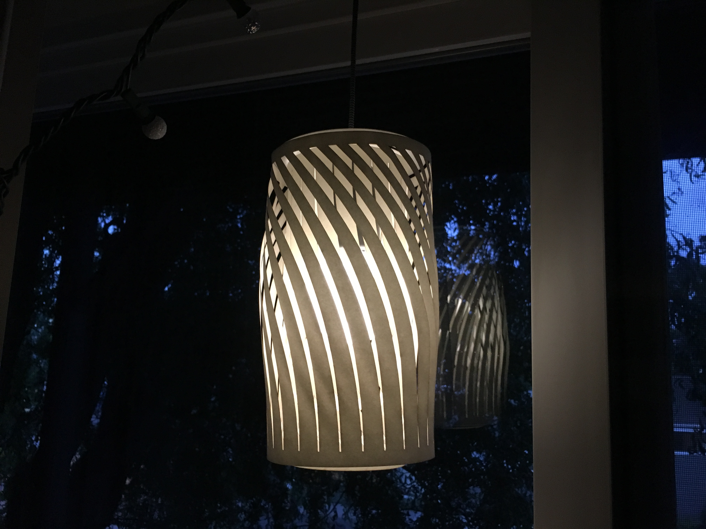
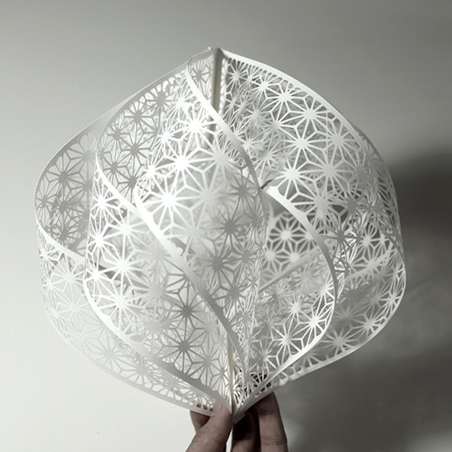
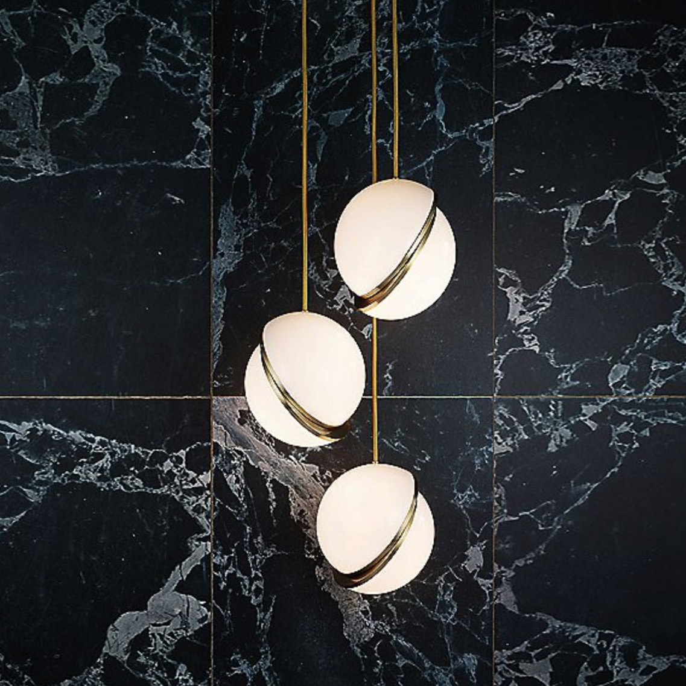
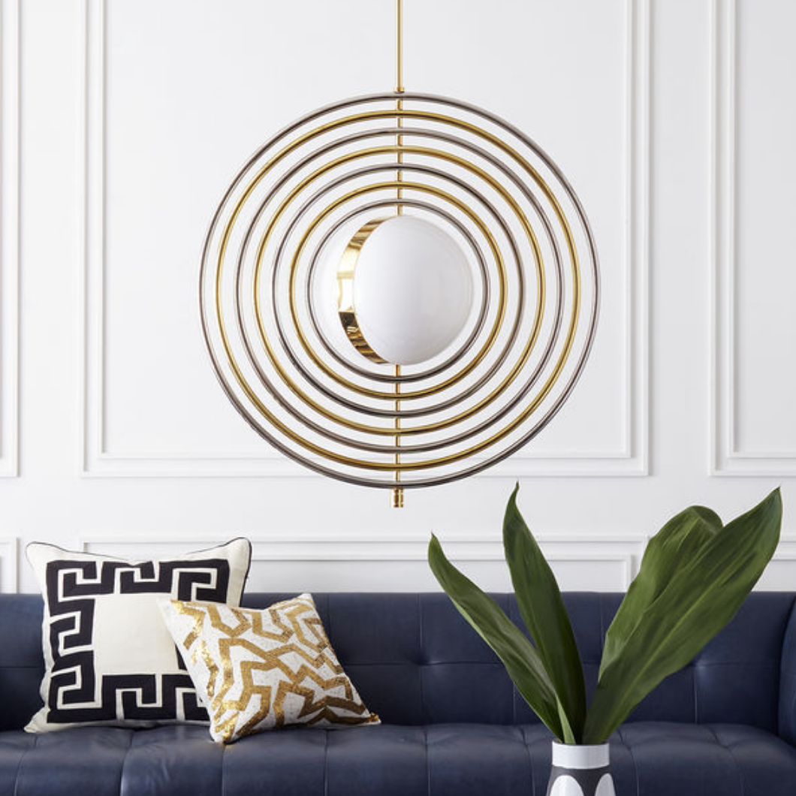
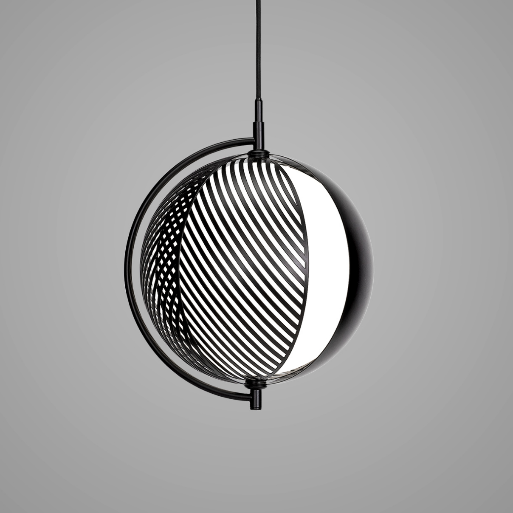
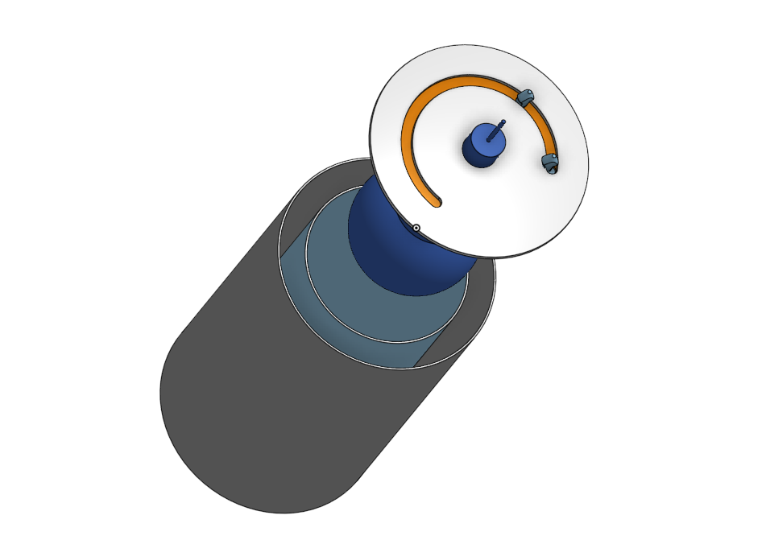
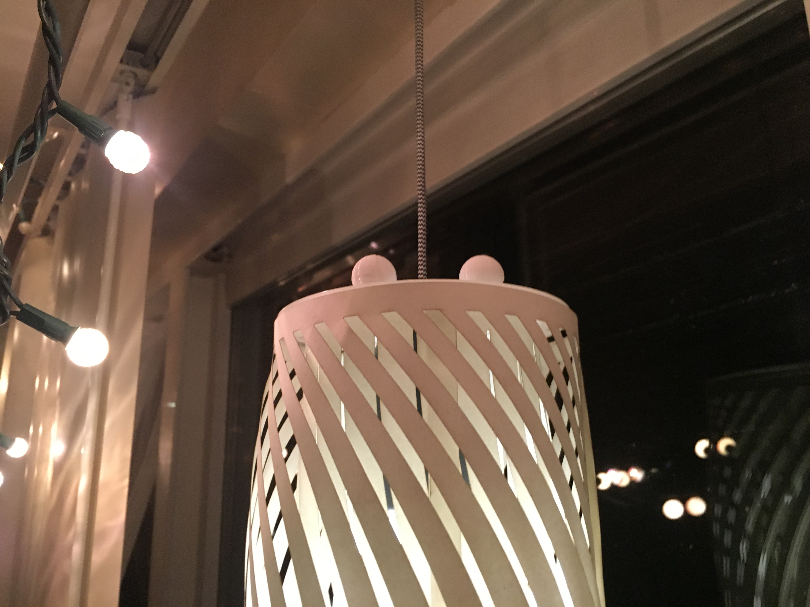
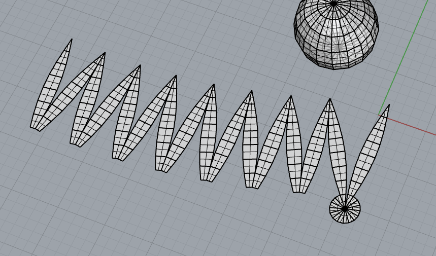
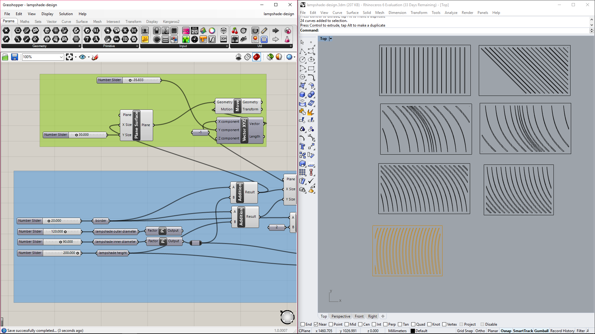
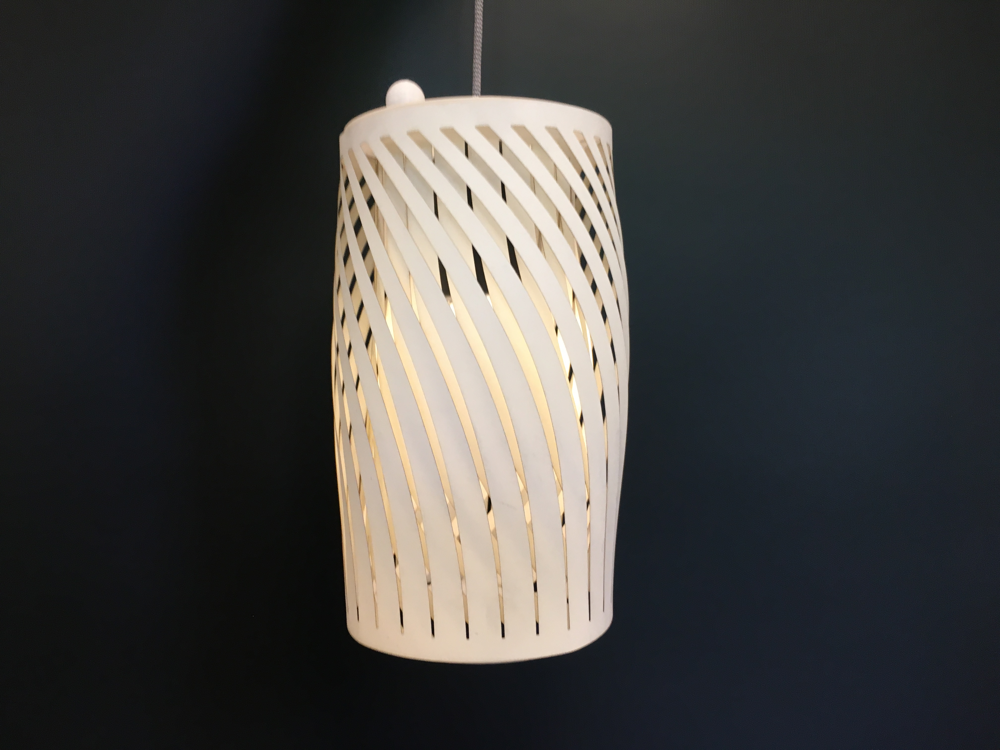

    
     <small><em>The final lamp.</em></small> 

<h1>Overview</h1>

I made a lamp with two layers of patterned lampshades. The inner lampshade rotates in order to create patterns with the outer lampshade.

<h1>Ideation and Concept</h1>

I wanted to play with light and have layers of moveable lampshades that would combine to create a lamp with dynamic light patterns. I wanted to revisit the lamp because I didn't get to spend as much time as I wanted to on the lamp assignment from a previous week (and because my cat chewed up the wire...). Moving parts was also a lot of fun, and I wanted to incorporate that into a lamp design.

While searching for inspiration, I was initially drawn to minimalist, spherical forms, though I knew that would have been challenging since flat items have been far easier to fabricate and work with. I was also inspired by geometric patterns and kept that inspiration to base my project on.

    
    
    
    
     <small><em>Sources from the original proposal, from top left to bottom right: <a href="https://mymodernmet.com/christine-kim-paper-cut-sculptures/">My Modern Met</a>, <a href="https://www.ylighting.com/mini-crescent-led-chandelier-by-lee-broom-LEEP151607.html">ylighting</a>, <a href="https://www.jonathanadler.com/out-of-stock-online/electrum-kinetic-chandelier/26506.html">Jonathan Adler</a>, <a href="https://oblure.com/products/mondo-pendant/">Oblure</a></em></small> 

    

For this week in particular, I also started the project with the assumption that <a href="https://en.wikipedia.org/wiki/Murphy's_law">everything that can go wrong, will go wrong (Murphy's Law)...</a> especially in a lab setting with limited resources for 40+ people, so I intentionally played it safe and stuck with materials that I knew I wouldn't have too much trouble fabricating.

<h1>Process</h1>

<h2>Bill of Materials</h2>

<ul>
    <li>LED Pendant Lamp from Target, $10</li>
    <li>White Posterboard from Bartell's, $5, used for the lampshade</li>
    <li>Delrin - 1/8" from Amazon, $18, used for the lamp base and inner ring</li>
    <li>Plastic Rivets from Joshua, used to fasten the lamp base, ring, and knobs</li>
    <li>3D Filament from Fluke, used for the knobs</li>
</ul>

<h2>Techniques</h2>

<ol>
    <li>Moving parts: Lamp base</li>
    <li>Laser cutting: Lamp base and lamp shade</li>
    <li>3D Printing: Knobs for the rotating mechanism.</li>
    <li>Parametric modelling: Lamp shade</li>
</ol>

<h2>Lamp Base</h2>

I designed the lamp base mainly in Onshape. After a couple of iterations, I decided to make it big enough for a cylindrical lampshade design because I found the spherical shape a little too large. Plus, a cylindrical shape means I won't need to find a way to build the scaffolding for the paper lamp shade. The base has a track in the middle that will allow for us to fit in rivets that carry a secondary lamp shade on the inside. I also created 3D printed knobs, which are hollow spheres with a hole at the bottom sized to snap onto the rivet and hold them in place.

I cut the Delrin base twice because the initial size was made for the sphere design. Luckily, I used lots of vars in my OnShape design so scaling up the base was fairly easy.

Fabrication went fairly smoothly. I used laser cutters at both the MILL and at Fluke on different days. Learning how to use the Fluke's laser cutters took a little time but ended up being a little more streamlined for me. Plus, I never had to wait for long for the Fluke machines.

    
    
     <small><em>OnShape CAD model on the left, and small 3D printed knobs for the plastic rivets on the right.</em></small> 

<h2>Lamp Shade</h2>

I originally planned on making a spherical lamp shade and made a couple of preliminary designs for it. This lamp shade was going to be cut out of a flat sheet of paper, so I found <a href="https://erikdemaine.org/papers/SphereWrapping_CGTA/paper.pdf">a paper</a> and <a href="https://www.youtube.com/watch?v=nayHHsyuP0Y">this video tutorial</a> that explained how to cut out a piece of paper that could be reassembled into a sphere. I managed to create this "flower" pattern that could be wrapped together to make a round shape, but decided not to move forward with that idea because I would have to create another shell to get the paper to hold its shape. I decided to go for a cylindrical lamp with patterned cutouts instead.

    
     <small><em>An early attempt at "unrolling" the surface of a sphere to laser cut.</em></small> 

After I decided to go with a cylinder shape, I calculated the required length and width for two lamp shades and used Grasshopper and Rhino to create patterns on the lamp shade. I initially experimented with variable patterns using attractors (using <a href="http://grasshopperprimer.com/en/1-foundations/1-3/2_working-with-attractors.html">a tutorial from ModeLab</a>) and dynamic spacing, though I wasn't able to make a pattern I was really happy with. I ended up sticking with a linearly-spaced pattern of a hyperbolic curve.

For this part, I also used the laser cutter at Fluke. Cutting a single sheet resulted in a lot of burn marks, so I cut two pieces together so that the bottom piece would catch <em>most</em> of the burn marks. There was still a bit of burning, but it wasn't very noticible with the light on so I didn't want to fuss too much about it.

I also originally planned to also cut out regularly spaced cut strips on the top of the lampshades to bond with the lamp, but forgot before I came to lab to cut... I ended up using small strips of masking tape all round the edges (on the inside). I had planned to try superglue, which seemed to work for bonding leftover Delrin pieces, but decided to just keep the tape since it holds surprisingly well, certainly enough for a hanging lamp.

    
     <small><em>Part of the Grasshopper definition and a few iterations of the lamp shade design.</em></small> 

<h1>Results</h1>

The lamp was easy to put together and I didn't get caught in the mad laser cutter chaos at the MILL. The end result was simple but satisfying (even if it makes my apartment smell like BBQ). I'm glad I tried using the Fluke machines, because everything worked far better for me. And while I didn't take too many chances with this project, I found that I was <em>much</em> less intimidated by the idea of designing and fabricating something new when I needed it.

The revolving mechanism worked just as expected. The light from the lamp is nicely diffused from far away, and makes a soft, pleasing "flicker" when the inner shade is rotated. I would definitely like to iterate in the future and find a cleaner way to fix the lampshade to the base, as well as design more interesting lampshades.

    
     <small><em>Lamp in daylight.</em></small> 

    
     <small><em>Rotating the inner shade to create patterns.</em></small> 

<h1>Source Files</h1>

<ul>
    <li><a href="https://cad.onshape.com/documents/1dd8fa8a968dae5182df24c5/w/d4aa9dbc18a042bbce3e5809/e/e85d5392fdd1273a17b022f6">OnShape Model</a></li>
    <li><a href="/project-files/a8/rivet-cap.stl">Stupid triangle list for 3D printed knob</a></li>
    <li><a href="/project-files/a8/lampshade-design.3dm">Rhino design file</a></li>
    <li><a href="/project-files/a8/lampshade-design.gh">Grasshopper design file</a></li>
    <li><a href="/project-files/a8/lampshade-final.3dm">Final design of lampshades</a></li>
</ul>

<h1>References</h1>

<ul>
    <li><a href="https://mymodernmet.com/christine-kim-paper-cut-sculptures/">My Modern Met - Gorgeously Intricate Hand-Cut Paper Sculptures</a></li>
    <li><a href="https://www.ylighting.com/mini-crescent-led-chandelier-by-lee-broom-LEEP151607.html">ylighting - Mini Crescent LED Chandelier</a></li>
    <li><a href="https://www.jonathanadler.com/out-of-stock-online/electrum-kinetic-chandelier/26506.html">Jonathan Adler - Electrum Kinetic Chandelier</a></li>
    <li><a href="https://oblure.com/products/mondo-pendant/">Oblure - Mondo Pendant</a></li>
    <li><a href="https://erikdemaine.org/papers/SphereWrapping_CGTA/paper.pdf">Erik Demaine - Wrapping Spheres out of Flat Paper</a></li>
    <li><a href="https://www.youtube.com/watch?v=nayHHsyuP0Y">Becky Chierichetti - Unroll Surface in Rhino 4: Tricks for managing compound curves</a></li>
    <li><a href="http://grasshopperprimer.com/en/1-foundations/1-3/2_working-with-attractors.html">Mode Lab - Working with Attractors</a></li>
</ul>
